# Architecture: Ports & Adapters

## Overview
This project uses the Ports & Adapters (Hexagonal) architecture to create a composable, testable system for playing WoW 3.3.5a on Apple Silicon.

## Core Principles

### Dependency Rule
Dependencies point INWARD: External libraries → Adapters → Ports → Domain Logic.

This means:
- Domain logic knows nothing about external libraries
- Adapters implement Ports to interface with external libraries
- We can swap implementations without touching core logic

### Build UPON, Don't Replace
We CALL existing libraries, we don't modify them:
- **rosettax87_jit**: Loaded via FFI, wrapped in adapter
- **winerosetta**: Loaded via FFI, wrapped in adapter
- **CrossOver**: Integrated via macOS APIs, wrapped in adapter

## Architecture Layers

```
rust-core  (domain + use-case DTOs + secondary ports)
    ↑ Rust API (compiler-enforced)     ↑ Rust API (compiler-enforced)
CLI (clap → DTOs → core)        GUI Backend (JSON → DTOs → core)
                                          ↑ Tauri IPC (type-generated via specta)
                                   GUI Frontend (TypeScript — types from gen/bindings.ts)
```

### 1. Domain Layer (rust-core)
Contains business logic, port definitions, and use-case DTOs:

```rust
// Ports define the secondary-side contracts
pub trait RunnerPort: Send + Sync { ... }
pub trait RosettaTranslationPort: Send + Sync { ... }
pub trait WineIntegrationPort: Send + Sync { ... }

// Use-case DTOs — the primary-side contracts (see Primary Adapters below)
pub struct LaunchOptions { ... }
pub struct SetupOptions { ... }
pub struct DiagnoseOptions { ... }
```

### 2. Adapter Layer
Wraps external libraries to implement ports:

```rust
pub struct Rosettax87Adapter { ... }  // implements RosettaTranslationPort
pub struct CrossOverAdapter { ... }   // implements RunnerPort
pub struct WhiskyAdapter { ... }      // implements RunnerPort
```

### 3. Integration Layer
Orchestrates a full WoW session (`WowLauncher`) or one-time setup (`SetupOrchestrator`):

```rust
pub struct WowLauncher {
    runner: Arc<dyn RunnerPort>,
    ...
}
impl WowLauncher {
    pub fn from_options(options: LaunchOptions) -> Result<Self, LaunchError> { ... }
    pub fn launch_wow_logged(&self, wow_dir: &Path, log_path: Option<&Path>) -> Result<WowSession, LaunchError> { ... }
}
```

## Primary Adapters

```
┌──────────────────────────────────────────────────────────┐
│               Hexagonal Architecture                      │
│                                                           │
│  Primary Adapters (Driving)   │   Secondary Adapters      │
│  ─────────────────────────    │   (Driven)                │
│  CLI (clap → DTOs)            │   CrossOverAdapter        │
│  GUI Backend (JSON → DTOs)    │   WhiskyAdapter           │
│              ↓                │   Rosettax87JitAdapter    │
│         Use-Case DTOs         │          ↑                │
│  LaunchOptions / SetupOptions │   Secondary Ports         │
│  DiagnoseOptions              │   RunnerPort              │
│              ↓                │   RosettaTranslationPort  │
│         Domain / Core Logic   │   WineIntegrationPort     │
└──────────────────────────────────────────────────────────┘
```

`LaunchOptions`, `SetupOptions`, and `DiagnoseOptions` (in `rust-core/src/options.rs`) are the **use-case DTOs** — the formal primary-port contracts. The convention is:

> Any new adapter (REST API, TUI, test harness) that wants to call core creates one of these structs and calls the matching function — no other wiring needed.

The CLI and GUI are the two current primary adapters:
- **CLI** translates clap args → DTO → core
- **GUI Backend** translates Tauri IPC JSON → DTO → core

The GUI Backend no longer spawns `wowplay` as a subprocess — it calls core directly via `WowLauncher::from_options` and `SetupOrchestrator::run`. This eliminates runtime drift between the two interfaces.

## Type Generation Pipeline

TypeScript types for the GUI frontend are generated from Rust types rather than hand-written:

1. Rust types derive `specta::Type` (e.g. `AppConfig`, `SetupResult`, `ValidationResult`)
2. `cargo test --manifest-path packages/gui/Cargo.toml export_bindings` runs the export test in `gui/src/lib.rs`
3. The test writes `src-frontend/gen/bindings.ts` via `tauri-specta`
4. `src-frontend/lib/tauri.ts` imports from `gen/bindings.ts` instead of hand-duplicating interfaces

`gen/bindings.ts` is in `.gitignore` — always regenerate after changing command input/output types.

## Data Flow

```mermaid
flowchart TD
    subgraph one-time_patch ["One-time patch step"]
        patcher["Native PE Patcher (Rust)"] -->|"patches"| DivxDecoder["DivxDecoder.dll"] -->|"loads on game start"| winerosetta_mods["mods/winerosetta.dll"]
        winerosetta_mods -->|"reads"| dlls_txt["dlls.txt"] -->|"loads"| libSiliconPatch["mods/libSiliconPatch.dll"]
    end

    subgraph launch_chain ["Launch chain"]
        rosettax87["rosettax87<br/>(x86/x87 → AArch64 JIT wrapper)"] --> wineloader2["wineloader2<br/>(x86_64 Wine loader, unsigned for JIT hooking)"]
        wineloader2 --> rosetta2["Rosetta 2<br/>(x86_64 → AArch64 translation)"]
        rosetta2 --> crossover["CrossOver / Wine WoW64<br/>(32-bit Windows on 64-bit Wine)"]
        crossover -->|"DivxDecoder.dll loads mods/winerosetta.dll here (VEH installed)"| wow_exe["WoW.exe<br/>(32-bit x86 Windows)"]
        wow_exe --> native["Native macOS execution<br/>(Apple Silicon)"]
    end
```



### Why wineloader2?

CrossOver's `wineloader` (x86_64 on CrossOver 24) is code-signed with hardened runtime flags that prevent runtime modification. Since `rosettax87` needs to install JIT translation hooks, we:
1. Copy `wineloader` (x86_64) → `wineloader2`
2. Remove the code signature with `codesign --remove-signature`
3. Launch WoW as: `rosettax87 wineloader2 WoW.exe`

**Why not the 32-bit wineloader?** macOS 10.15+ removed kernel support for exec-ing i386 Mach-O binaries entirely. `wineloader2` must be x86_64 so Rosetta 2 can run it. Wine's internal WoW64 thunks then load the 32-bit `WoW.exe` inside that 64-bit wine process.

### Why DivxDecoder bootstrap?

`winerosetta.dll` cannot load itself — it must be brought in by Wine's native DLL loader. The client's existing `DivxDecoder.dll` is the injection anchor:
1. Our native Rust PE patcher rewrites `DivxDecoder.dll` in-place (backed up to `.bak`) to import `mods/winerosetta.dll`.
2. When WoW.exe starts, Wine loads DivxDecoder.dll as usual, which now pulls in winerosetta.
3. winerosetta installs its vectored exception handler (VEH) and optionally reads `dlls.txt` to load `mods/libSiliconPatch.dll` (disabled via `--disable-lib-silicon`).
4. The VEH hot-patches illegal x87 opcodes (`fcomp st`, `arpl`) that rosettax87's JIT alone cannot handle.

This is the recipe used by WoWSilicon (applyGamePatch + patchDivxDecoder) for CrossOver 24.

## Testing Strategy

### MRE (Minimal Reproducible Example) Tests
Headless tests that validate translation without running WoW:
```rust
#[test]
fn test_rosettax87_fxch_translation() {
    let adapter = Rosettax87Adapter::new().unwrap();
    let fxch_bytes = vec![0xD9, 0xC9];
    let result = adapter.translate_x87_instruction(&fxch_bytes);
    assert!(result.is_ok());
}
```

### End-to-End Tests
Full WoW launch and gameplay validation:
```rust
#[test]
#[ignore] // Run manually
fn test_wow_launches_and_runs() {
    // Launch WoW, verify x87 translation active
}
```

## Migration Path

### Phase 1: Open-Source Integration
- Wrap rosettax87_jit via FFI
- Wrap winerosetta via FFI
- Test with MRE harness

### Phase 2: Working POC
- Integrate with CrossOver
- Launch WoW successfully
- Verify gameplay

### Phase 3: Progressive Enhancement
- Recreate libSiliconPatch in Rust (optional — VEH may suffice on Whisky/CrossOver)
- Add new features via ports/adapters
- Improve test coverage

## External Runtime Dependencies

The binaries listed below are copied from an installed WoWSilicon.app at launch time
(`wowplay setup` / `apply_game_patch`). We build `winerosetta.dll` ourselves via zig-glue;
the others are not yet open-sourced or vendored. Full inventory with replacement roadmap: [`assets/external/README.md`](../assets/external/README.md).

| File | Source | Status |
|---|---|---|
| `winerosetta.dll` | Built by zig-glue from vendored C++ | Open-source (Gcenx/winerosetta) |
| `mods/libSiliconPatch.dll` (WotLK) | WoWSilicon.app bundle | Closed-source — **optional** (enabled by default; disable via `--disable-lib-silicon`) |
| `d3d9.dll` | WoWSilicon.app bundle (D9VK) | Open-source — candidate to vendor |
| `rosettax87` + `libRuntimeRosettax87` | WoWSilicon.app bundle | Open-source — candidates to vendor |

## WoW-specific vs General

The architecture is layered so the general machinery can be reused for other Windows games:

| Layer | General | WoW-specific |
|---|---|---|
| Ports & Adapters pattern | ✅ | — |
| FFI wrapping / adapter pattern | ✅ | — |
| MRE test harness | ✅ | — |
| Profiling pipeline | ✅ mostly | Change trace targets |
| x87 VEH / ARPL emulation | — | ✅ WoW-only |
| DLL injection bootstrap (DivxDecoder) | — | ✅ WoW-only |
| libSiliconPatch recreation | — | ✅ WoW-only |

The three WoW-only blocks depend on game-specific binary layout and opcode quirks.
The three general blocks (`ports/adapters`, `FFI`, `MRE harness`) have no WoW coupling
and can be extracted to a shared crate if a second game target is added.

## See Also
- [Porting Policy](porting-policy.md)
- [Testing Strategy](testing-strategy.md)
- [Git Workflow](git-workflow.md)
