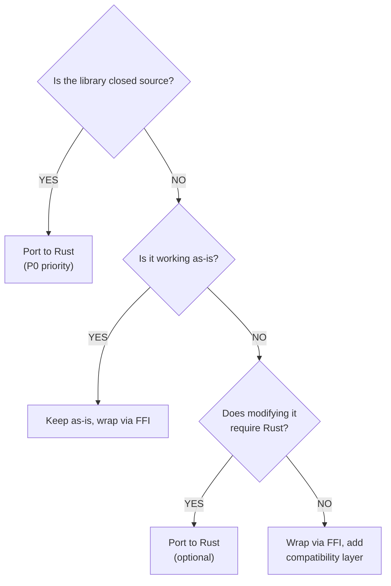

# Porting Policy: When and Why We Port to Rust

## Current Dependencies

### Open Source Libraries (Keep as-is)
- **rosettax87_jit** (C++): Open source, actively maintained
- **winerosetta** (C): Open source, actively maintained

### Closed Source (P0 for Recreation)
- **libSiliconPatch**: Closed source, optional for WoW 3.3.5a on Apple Silicon (enabled by default; can be disabled via `--disable-lib-silicon` flag)

## Porting Decision Matrix

### ✅ Keep as-is (C/C++)
**Use when:**
- Library is open source and working
- No modifications needed
- Performance is acceptable
- Maintenance burden is low

**Examples:**
- rosettax87_jit: Working well, actively maintained
- winerosetta: Stable, handles Wine integration

### ✅ Wrap via FFI
**Use when:**
- Library is working but needs integration
- We need to compose multiple libraries
- Future Rust migration possible
- We need to control the interface

**Examples:**
- Initial rosettax87_jit integration
- Initial winerosetta integration

### ❌ Port to Rust (P0 - Critical Priority)
**Use when:**
- Library is **CLOSED SOURCE**
- Security audit needed
- Modifications required for our use case
- Legal/compliance requirements

**Examples:**
- **libSiliconPatch**: Closed source, optional ( Whisky/CrossOver VEH may suffice); port if additional coverage needed

### 🤔 Port to Rust (Optional)
**Use when:**
- Extending library would benefit from Rust ecosystem
- Complex business logic we want to test thoroughly
- Memory safety is critical
- Performance profiling shows Rust would help

**Examples:**
- Custom x87 optimization passes
- Advanced translation caching

## Process

### 1. Start with FFI Wrapper
```rust
pub struct ExternalLibAdapter {
    library: libloading::Library,
}

impl PortTrait for ExternalLibAdapter {
    fn method(&self) -> Result<()> {
        unsafe { /* call external lib */ }
    }
}
```

### 2. Build Test Coverage
```rust
#[test]
fn test_external_lib_behavior() {
    let adapter = ExternalLibAdapter::new().unwrap();
    // Document current behavior
    assert!(adapter.method().is_ok());
}
```

### 3. Port Incrementally (If Needed)
```rust
// Rust implementation
pub struct RustImplementation;

impl PortTrait for RustImplementation {
    fn method(&self) -> Result<()> {
        // Pure Rust implementation
    }
}
```

### 4. Validate Against Original
```rust
#[test]
fn test_rust_matches_c() {
    let c_adapter = ExternalLibAdapter::new().unwrap();
    let rust_impl = RustImplementation::new();
    
    // Compare outputs
    assert_eq!(c_adapter.method(), rust_impl.method());
}
```

## Decision Flowchart



## Examples

### Case 1: rosettax87_jit (Keep as-is)
- ✅ Open source
- ✅ Working well
- ✅ Actively maintained
- ❌ No need to port initially

**Action:** Wrap via FFI, monitor upstream changes.

### Case 2: libSiliconPatch (Optional Port)
- ❌ Closed source
- ⚠️ Optional — Whisky/CrossOver VEH handles x87 exceptions without it
- ✅ Works with winerosetta VEH on most setups
- ❌ Cannot audit or extend

**Action:** Keep as optional FFI; port to Rust only if VEH coverage proves insufficient.

### Case 3: Future Custom Optimization (Optional Port)
- ✅ We control the code
- ✅ Complex business logic
- ✅ Benefits from Rust testing

**Action:** Start in Rust if complex, port if proven useful.

## Principles

1. **Don't Fix What Isn't Broken**: Working C/C++ code stays C/C++
2. **Port for Control**: Port when we need to audit, extend, or modify
3. **Port for Safety**: Port closed-source components for security
4. **Port for Testing**: Port complex logic that needs thorough testing

## Timeline

### Phase 0-1: Foundation & Architecture
- Wrap existing libraries via FFI
- Focus on test coverage

### Phase 2: Working POC
- Validate architecture with open-source libraries
- Document closed-source requirements

### Phase 3: Progressive Enhancement
- Recreate libSiliconPatch in Rust (P0)
- Port other components if needed

## See Also
- [Architecture](architecture.md) - How ports and adapters work
- [Testing Strategy](testing-strategy.md) - How we validate ports
