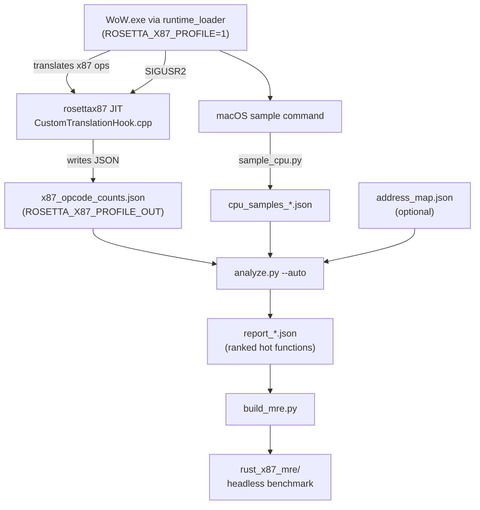

# WoW Profiling Guide

Complete workflow for profiling WoW 3.3.5a on Apple Silicon.

## How It Works

Two complementary data sources, both SIP-safe and sudo-free:

| Source | Tool | What it measures |
|---|---|---|
| JIT opcode counter | `ingest_jit_counts.py` | Exact x87 instruction translation frequency |
| Host CPU sampler | `sample_cpu.py` | Address-level hotspots via macOS `sample` |

The x87 counts come from inside the rosettax87 JIT itself (`CustomTranslationHook.cpp`).
Set `ROSETTA_X87_PROFILE=1` at launch; send `SIGUSR2` to dump the accumulated
counts to `ROSETTA_X87_PROFILE_OUT`.

Frida is not used. The WoW process is `Code Type: X86-64 (translated)` and an
arm64 Frida binary cannot inject into a Rosetta-translated process — `sudo`
does not fix the architectural mismatch.

## Prerequisites

- macOS 15+ with Apple Silicon
- `mise` / `uv` toolchains installed
- WoW 3.3.5a client (ChromieCraft_3.3.5a or similar)
- `wowplay` built (`cargo build --release`)

## Quick Start

```bash
# Install Python profiler deps
just profiler-setup

# Profile in one command (launches WoW, waits, profiles, kills, generates MRE)
just profile-full         # no libSiliconPatch
just profile-full-patch   # with libSiliconPatch
```

## Step-by-Step (Manual)

### 1. Launch WoW with JIT Profiling Enabled

```bash
ROSETTA_X87_PROFILE=1 ROSETTA_X87_PROFILE_OUT=/tmp/rosettax87_profile.json \
    just wow-sans-patch
```

Log in and go to a busy area (Dalaran is ideal for high x87 load).

### 2. Collect CPU Samples

In another terminal:

```bash
cd tools/profiler
uv run python3 sample_cpu.py --duration 300   # 5 min
```

Saves to `data/profiling/cpu_samples_YYYYMMDD_HHMMSS.json`.

### 3. Dump JIT x87 Counts

```bash
# Find WoW's runtime_loader PID and send SIGUSR2
kill -USR2 $(uv run python3 attach.py)
sleep 1   # wait for the file to be written
```

The JIT writes `x87_opcode_counts` + `translated_total` to
`/tmp/rosettax87_profile.json` (or `ROSETTA_X87_PROFILE_OUT`).

Preview the counts:

```bash
uv run python3 ingest_jit_counts.py
```

### 4. Generate Report

```bash
uv run python3 analyze.py --auto
```

Auto-discovers the JIT counts file and latest CPU samples.
Report saved to `data/profiling/reports/report_YYYYMMDD_HHMMSS.json`.

### 5. Generate MRE

```bash
just generate-mre
cd rust_x87_mre && cargo run --release
```

## Reading the Report

```json
{
  "hot_functions": [
    {
      "rank": 1,
      "address_hex": "0x006A3F20",
      "estimated_name": "sub_0x6a3f20",
      "source": "instruments",
      "sample_count": 45230,
      "x87_call_count": 0
    }
  ],
  "x87_summary": {
    "total_x87_calls": 1234567,
    "by_function": { "fmul": 400000, "fld": 350000, "fstp": 280000, ... },
    "by_module": {}
  }
}
```

`x87_summary.by_function` contains per-opcode counts from the JIT (not
per-function; the field name is historical). These weights feed `build_mre.py`
to generate a representative x87 benchmark.

## Configuration

Edit `tools/profiler/config.toml` for path overrides, or create
`tools/profiler/config.local.toml` (gitignored).

Key setting:

```toml
[jit_profile]
profile_out = "/tmp/rosettax87_profile.json"
```

## Regression Testing

Profile baseline (no patch):
```bash
just profile-full 300 30
# → report_A.json
```

Profile with fix applied:
```bash
just profile-full-patch 300 30
# → report_B.json
```

Compare `x87_summary.total_x87_calls` and `by_function` distributions.
A working fix should reduce translation counts for the targeted opcodes.

## Troubleshooting

### No WoW Process Found

```
Error: No Wine process found running WoW.exe
```

Ensure WoW is running and launched via `wowplay` (which starts `runtime_loader`).
`attach.py` looks for `wine64-preloader`, `wine64`, `wine`, and `runtime_loader`.

### JIT Profile File Not Found

```
Error: JIT profile not found: /tmp/rosettax87_profile.json
```

WoW was not launched with `ROSETTA_X87_PROFILE=1`, or no SIGUSR2 has been sent
yet. Use `just profile-full` which handles this automatically, or launch manually:

```bash
ROSETTA_X87_PROFILE=1 ROSETTA_X87_PROFILE_OUT=/tmp/rosettax87_profile.json \
    ./runtime_loader WoW.exe
```

### CPU Sample Fails

Ensure `sample` is available (it's a macOS developer tool):

```bash
xcode-select --install
```

## Architecture



## See Also

- [Project README](../../README.md)
- [Integration Tests](../../packages/integration/AGENTS.md)
- [Rust Core](../../packages/rust-core/AGENTS.md)
- [MRE Crate](../../rust_x87_mre/)
- [profiler AGENTS.md](../../tools/profiler/AGENTS.md)
