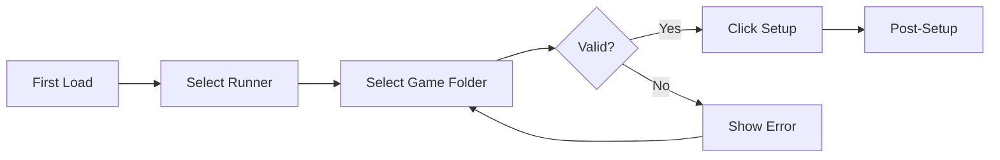
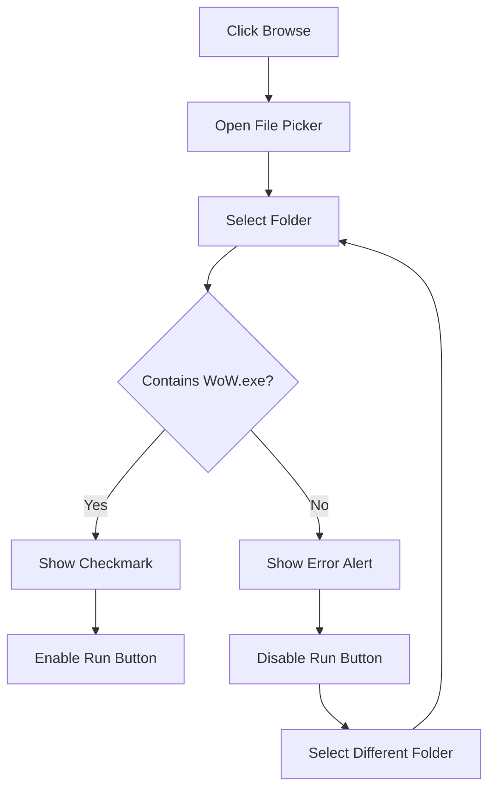
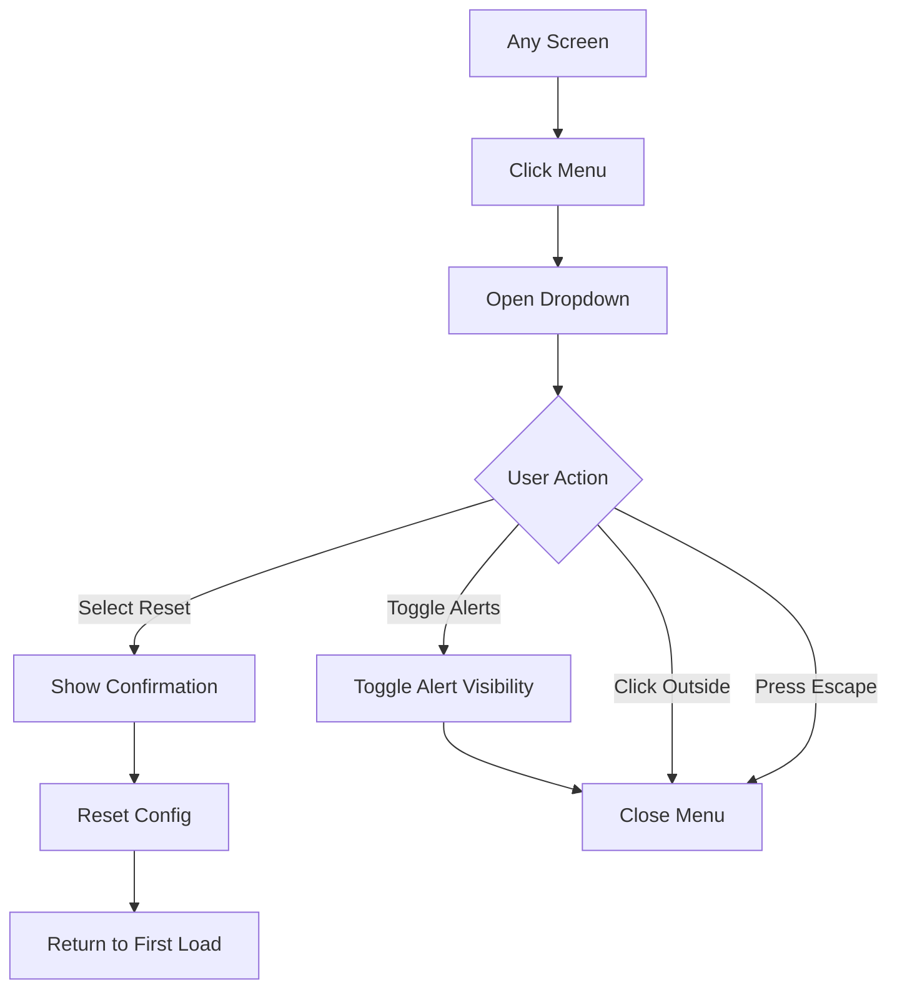
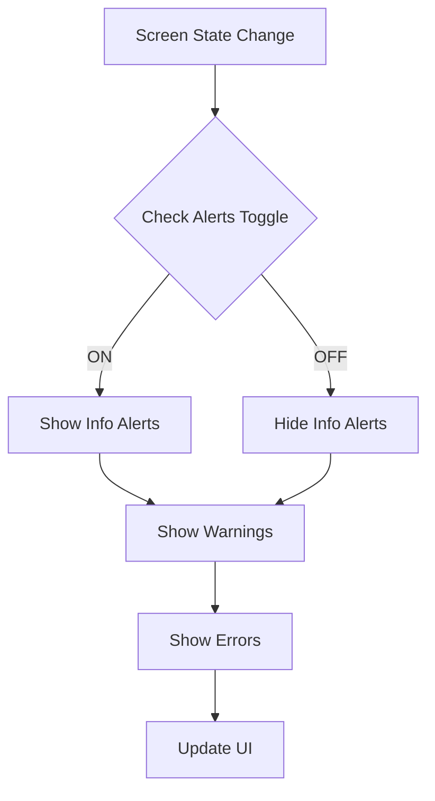
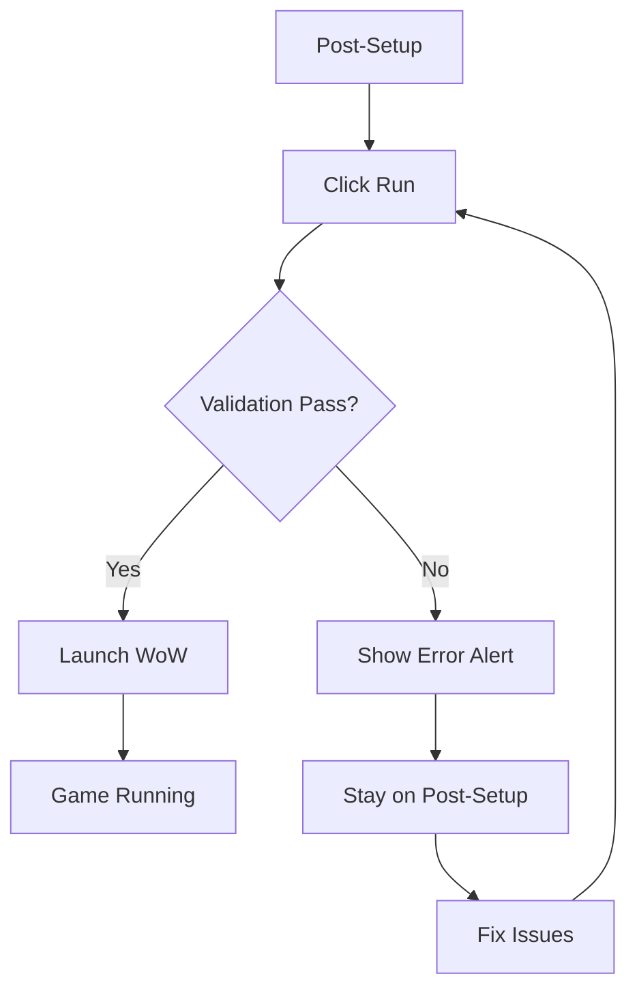

# Screen Wireframes

ASCII wireframes for the Tauri desktop application.

## Screens

1. [01-first-load.md](01-first-load.md) - Initial app state with Setup button
2. [02-post-setup.md](02-post-setup.md) - After configuration with Run button
3. [03-menu-open.md](03-menu-open.md) - Options menu expanded
4. [04-alert-states.md](04-alert-states.md) - Alert/Callout component variations
5. [05-runner-selector.md](05-runner-selector.md) - Runner dropdown expanded
6. [06-browse-dialog.md](06-browse-dialog.md) - Game folder file picker

## UX Flows

User flows in mermaid format.

### 1. Setup Flow (Happy Path)

### 2. Browse & Validate Flow

### 3. Menu Flow

### 4. Alert Visibility Flow

### 5. Run Flow

## Design Notes

- **Window**: Fixed-size modal-style window with macOS-style traffic lights
- **Menu**: "..." button at top-right reveals dropdown menu
- **Alerts**: Disabled by default; toggle via menu `Show alerts`
- **Errors/Warnings**: Always displayed regardless of alert toggle
- **No Cancel button**: Primary action only (Setup/Run)
- **Responsive**: All components stack vertically with consistent spacing
