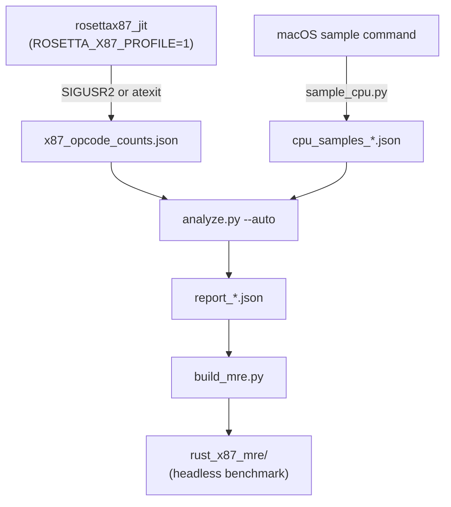

# profiler Package — Agent Guide

## Overview

Python profiling toolkit for WoW 3.3.5a on Apple Silicon.

**x87 opcode frequency** comes from the rosettax87 JIT itself: set
`ROSETTA_X87_PROFILE=1` at launch and the JIT counts every x87 instruction it
translates. Send `SIGUSR2` to dump the counts to `ROSETTA_X87_PROFILE_OUT`.

**CPU hotspots** come from the macOS built-in `sample` command, which works on
any process including Rosetta-translated ones — no SIP bypass or sudo required.

Frida is no longer used. The WoW process is `Code Type: X86-64 (translated)`
via Rosetta; an arm64 Frida binary cannot inject into it, and `sudo` does not
fix the architectural mismatch.

## Workspace

```
tools/profiler/
├── AGENTS.md              # This file
├── pyproject.toml         # Python dependencies (uv); Frida removed
├── config.toml            # Profiler configuration
├── attach.py              # Locate the WoW/runtime_loader process (no Frida)
├── ingest_jit_counts.py   # Read ROSETTA_X87_PROFILE_OUT JSON → x87 summary
├── sample_cpu.py          # CPU hotspots via macOS `sample` command
├── analyze.py             # Combine JIT counts + CPU samples → report_*.json
├── schema.py              # Report schema + merge_reports()
├── build_mre.py           # Generate rust_x87_mre from a report
└── frida_scripts/         # d3d9_hook.js, wine_filter.js (unused; kept for reference)
```

## Quick Start

```bash
# 1. Ensure deps
cd tools/profiler && uv sync

# 2. Launch WoW with JIT profiling enabled
ROSETTA_X87_PROFILE=1 ROSETTA_X87_PROFILE_OUT=/tmp/rosettax87_profile.json \
    just wow-sans-patch

# 3. In another terminal, run the profile recipe (no sudo)
just profile-quick       # 30s
just profile             # 5 min

# 4. Or manually:
cd tools/profiler
uv run python3 sample_cpu.py --duration 30
kill -USR2 $(uv run python3 attach.py)   # dump JIT counts
sleep 1
uv run python3 analyze.py --auto
```

## Key Env Vars

| Variable | Default | Description |
|---|---|---|
| `ROSETTA_X87_PROFILE` | — | Set to `1` to enable JIT opcode counting |
| `ROSETTA_X87_PROFILE_OUT` | `/tmp/rosettax87_profile.json` | Where the JIT writes counts |

## Profiling Data Sources

### JIT opcode counts (`ingest_jit_counts.py`)

The rosettax87 JIT instruments `hook_translate_insn` in
`rosetta_core/src/CustomTranslationHook.cpp`. For every x87 instruction the JIT
handles (i.e., `Translator::translate_instruction` returns a value), it
increments a per-opcode atomic counter.

Counters are dumped on demand via `SIGUSR2` (for a running session) or via
`atexit` when the process exits cleanly.

Output format:
```json
{
  "x87_opcode_counts": { "fmul": 12345, "fld": 9876, ... },
  "translated_total": 22221
}
```

`ingest_jit_counts.py` reads this file and converts it to the report schema's
`x87_summary.by_function` field (by_function is repurposed as by_opcode for
MRE instruction weighting).

### CPU samples (`sample_cpu.py`)

Wraps `sample <pid> <duration>`. Works on Rosetta-translated processes. Produces
`cpu_samples_*.json` with per-address sample counts used to rank `hot_functions`.

### Analysis (`analyze.py`)

Combines both sources:
- `x87_summary` from JIT counts (exact opcode frequencies)
- `hot_functions` ranked by CPU sample count (address-level hotspots)

`--auto` discovers both inputs automatically.

## Architecture



## Constraints

### DO
- Count x87 translation frequency via the JIT (exact, zero-overhead when off)
- Sample host CPU via `sample` (statistical, SIP-safe)

### DO NOT
- Use Frida — it cannot attach to Rosetta-translated processes from arm64
- Use `sudo` — not needed with this approach
- Disassemble or reverse-engineer WoW/libSiliconPatch

## Regression Workflow

Profile once without libSiliconPatch (`just profile-full`) and once with
(`just profile-full-patch`). Compare `x87_summary.total_x87_calls` and
opcode distributions across reports. A working libSiliconPatch should reduce
guest x87 translation counts for the ops it rewrites.

## See Also

- `docs/profiling-guide.md` — complete end-user workflow
- `vendor/rosettax87_jit/rosetta_core/src/CustomTranslationHook.cpp` — JIT counter impl
- `packages/rust-core/AGENTS.md` — Rust domain layer
